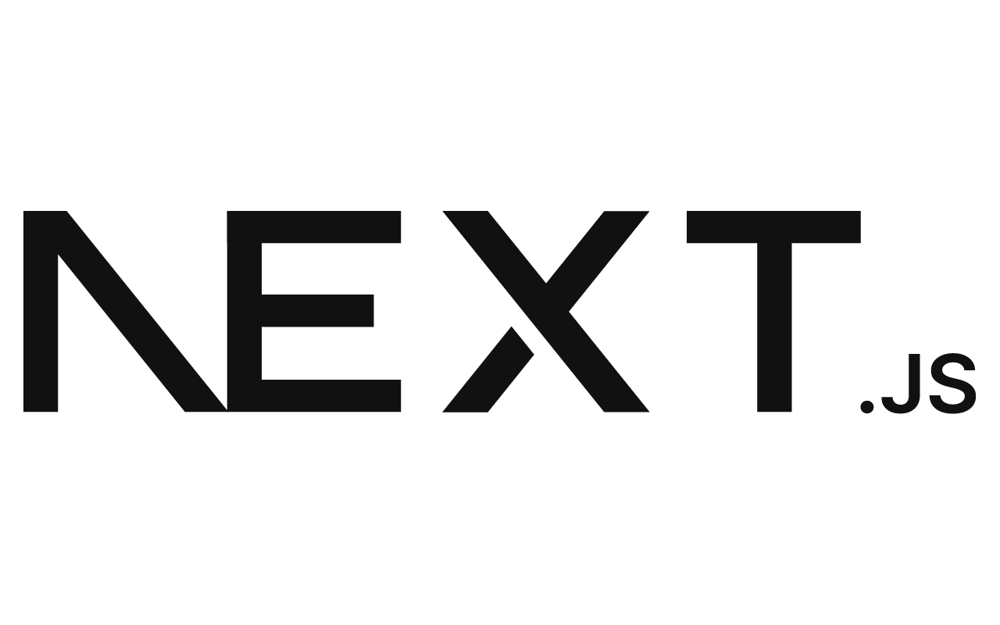

# ¡Hola! 👋 Soy Abel

### Desarrollador Full Stack

---

## Sobre mí 💻

Soy un **desarrollador web** apasionado por crear experiencias interactivas y dinámicas. Mi foco principal es **JavaScript** y el ecosistema moderno del frontend y backend.

En mis repositorios encontrarás proyectos reales donde aplico estas tecnologías. Me encanta aprender, compartir y construir soluciones que aporten valor.

---

## Mi portafolio 🌐

> **[Ver mi portafolio →](https://tu-portafolio.com)**  
> Proyectos, demos y experiencia en un solo lugar.

---

## Tecnologías y herramientas 🛠️

### Frameworks

  
  
  
  
  
  

### Lenguajes

  
  
  
  
  

### Backend, bases de datos y tiempo real

  
  
  
  
  

### UI, estilos y librerías

  
  
  
  
  

---

## Contacto 📬

¿Quieres conectar o colaborar? Puedes encontrarme aquí:

| Contacto | Enlace |
|----------|--------|
| 📧 Email | [aguado170305@gmail.com](mailto:aguado170305@gmail.com) |
| 📱 Teléfono | +51 983 446 294 |
| 💬 WhatsApp | [Escribirme por WhatsApp](https://wa.me/51983446294) |

---

**Gracias por visitar mi perfil.**  
*Si te interesa algún proyecto, no dudes en escribirme.* 🚀

